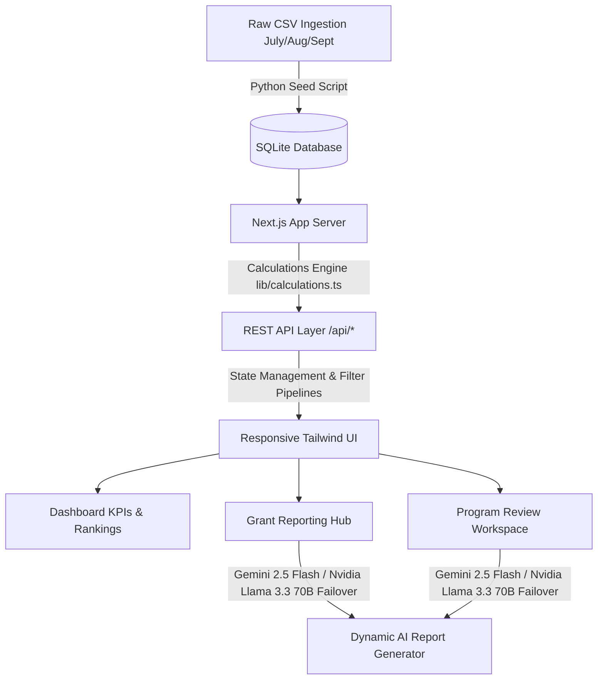

# Mantra4Change PBL Program Intelligence & Grant Reporting Assistant

A production-grade, state-of-the-art Next.js 14 web application and intelligence platform built to monitor, evaluate, and report on Project-Based Learning (PBL) programs. The platform supports complex analytical calculations, dual-model LLM narrative failovers, interactive program dashboards, and structured NGO evaluation templates.

Live Application: **[https://mantra4change-pbl-hvi4.onrender.com](https://mantra4change-pbl-hvi4.onrender.com)**

---

## 🌟 Architecture & Features



### 1. Calculation Engine (`/lib/calculations.ts`)
A fully deterministic, zero-dependency mathematical engine processing raw SQLite records to compute program status:
- **Participation Rate**: Ratio of schools submitting student progress data.
- **Evidence Submission Rate**: Percentage of active schools providing media evidence.
- **Attendance Rate**: Average student attendance computed across classrooms.
- **MoM Change**: Month-over-month percentage delta for program telemetry.
- **Risk Classifications**: Evaluates thresholds (`On Track` vs `Behind` vs `At Risk`).

### 2. Dual-LLM Failover System
The reporting engines utilize a resilient primary-to-secondary LLM configuration:
- **Primary Model**: Google Gemini (via `@google/generative-ai` SDK).
- **Secondary Model**: Meta Llama 3.3 70B Instruct (via OpenAI-compatible NVIDIA NIM API).
- **Fallback**: Pre-configured deterministic templates if both API channels fail.

---

## 🚀 Local Quickstart

### 1. Install Dependencies
```bash
npm install
```

### 2. Ingestion & Seeding
Place the 6 raw program CSVs in the `/data` directory and run the database bootstrapper:
```bash
npm run seed
```
This initializes a high-performance SQLite database (`/db/db.sqlite`) in WAL mode.

### 3. Environment Setup
Create a `.env` file at the project root:
```env
GEMINI_API_KEY=your_gemini_key_here

# Secondary OpenAI-Compatible LLM (Nvidia NIM, OpenRouter, Llama)
SECONDARY_LLM_API_KEY=your_llama_nvidia_api_key_here
SECONDARY_LLM_ENDPOINT=https://integrate.api.nvidia.com/v1
SECONDARY_LLM_MODEL=meta/llama-3.3-70b-instruct
```

### 4. Run Development Server
```bash
npm run dev
```
Visit the local dashboard at: `http://localhost:3000`

---

## 📦 Containerization & Render Deployment

The platform is designed to build and deploy as a Docker container, running a standalone optimized Next.js node bundle.

### Dockerfile Highlights
- **Multi-stage build**: Builder layer compiles assets, while a slim Alpine layer runs the server.
- **Native compilation**: Installs `g++`, `make`, and `python3` dynamically inside the builder to compile `better-sqlite3` bindings for Alpine Linux.
- **Security**: Runs under a non-root `nextjs` user.
- **Port & Hostname Routing**: Configured to bind on `0.0.0.0` and port `10000` for Render load balancers.

### Build and Run Docker Locally
```bash
docker build -t pbl-assistant .
docker run -p 10000:10000 --env-file .env pbl-assistant
```

---

## 🛠️ API Routes Reference

| Method | Endpoint | Query Parameters | Description |
| :--- | :--- | :--- | :--- |
| **GET** | `/api/health` | None | Returns database status & row counts |
| **GET** | `/api/filters` | None | Lists available Months, Districts, Grades, Subjects |
| **GET** | `/api/filters/blocks` | `?district=Name` | Returns blocks corresponding to a district |
| **GET** | `/api/dashboard/kpis` | `?month=YYYY-MM&district=...&block=...` | Returns active KPIs and MoM changes |
| **GET** | `/api/dashboard/districts` | `?month=YYYY-MM` | Returns school metric performance by district |
| **GET** | `/api/dashboard/blocks` | `?month=YYYY-MM` | Returns school metric performance by block |
| **GET** | `/api/schools` | `?month=YYYY-MM&district=...&block=...` | Returns granular list of school statuses |
| **GET** | `/api/grants` | None | Lists available donor grants |
| **GET** | `/api/grants/[id]` | `?month=YYYY-MM` | Returns budget lines and media indices for a grant |
| **POST**| `/api/grants/generate-narrative`| Body: `{ grantId, month, facts }` | Triggers LLM/Llama narrative report generation |
| **POST**| `/api/review/generate` | Body: `{ month, district, facts }` | Generates NGO Program Evaluation & Corrective Plan |
